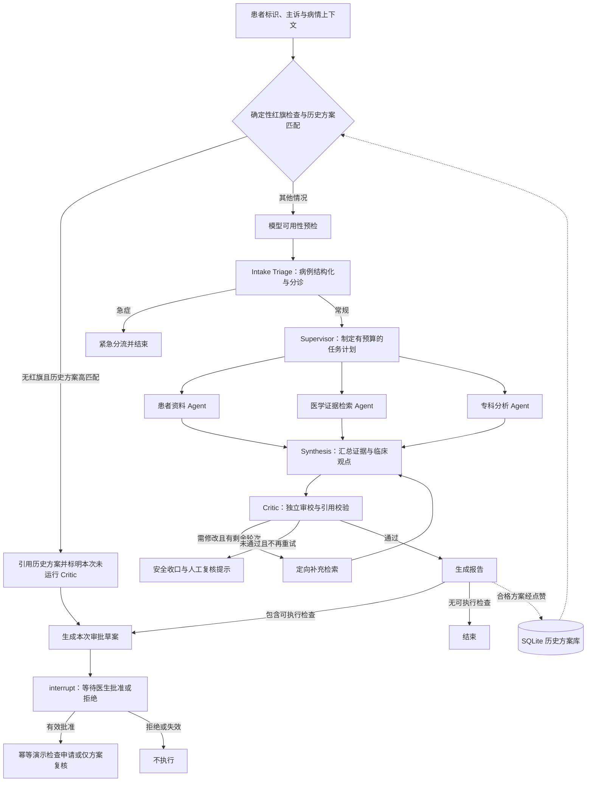

# Medical Agent

基于 **LangGraph、LangChain 和 FastAPI** 的多智能体临床决策支持原型。项目将病例输入、任务规划、并行证据收集、报告生成、独立审校和医生审批组织为可追踪、具有资源上限的状态图，并通过浏览器展示执行过程。

项目使用模拟患者记录、演示医学资料和演示检查申请工具，用于研究 Agent 编排与人机协作流程，不是经过临床验证的诊疗产品。

## 整体设计

核心思路是将“获取事实”“形成判断”“审校判断”和“执行操作”分开：只读工具负责提供证据，模型输出受结构约束，可能产生操作的检查申请通过独立审批节点执行。



### 有界多智能体协作

- **Intake Triage**：结合确定性规则和结构化模型输出识别主诉、缺失信息与分诊路径。
- **Supervisor**：依据病例复杂度分配资料读取、检索问题与专科视角，并限制调用预算。
- **三路并行分析**：患者资料、指南证据和专科观点各自更新共享状态，全部完成后进入 Synthesis。并行字段通过 reducer 合并。
- **Synthesis 与 Critic**：先融合证据生成结构化结论，再独立检查证据引用、信息缺口与安全问题。需要补充且预算允许时定向检索，否则输出报告或安全收口。

图结构固定，自适应体现在路由、任务内容、专科视角数量和有限反思轮次；默认最多 2 个专科视角、4 次记录读取、3 个指南检索问题和 1 轮反思。

### 检索与证据

RAG 结合 BM25 稀疏检索与 Chroma 向量检索，默认融合权重为 0.4 / 0.6，嵌入模型为 `BAAI/bge-base-zh-v1.5`。BM25 当前索引内置演示文本，向量检索读取本地集合；两者的语料范围可能不同。检索器延迟初始化，首次运行可能下载嵌入模型。

工具返回结构化事实、来源标识、时间和演示数据标签。报告保留证据引用，确定性校验与模型审校共同检查引用关系。内置资料是软件演示数据，不代表真实指南数据库。

### 医生审批与工具执行

只读查询与检查申请分开。检查草案绑定病例、患者、版本、内容哈希和有效期；LangGraph `interrupt()` 暂停流程，`/confirm_tool` 校验医生令牌、角色和草案一致性后，通过 `Command(resume=...)` 恢复。执行器使用幂等控制处理重复请求。

执行器与去重记录目前保存在进程内，未连接真实医院系统。医生身份使用服务端配置的共享令牌，生产部署需要独立身份认证、持久化状态及审计设施。

### 本地历史方案复用

符合准入条件的点赞方案存入 SQLite。匹配前过滤身份信息，并结合主诉规范化、相似度、已识别症状与否定冲突进行筛选。确定性红旗阻止直接复用。

高匹配方案直接引用历史内容，跳过本次模型分析、RAG 和 Critic，但生成新的病例与审批草案；即使没有检查项目，也需要本次医生复核。历史患者事实和审校结果不能视为当前患者的事实或审批。主诉相似不等于病情一致，规则过滤也不构成通用匿名化保证。

## 技术框架与目录

| 文件 | 职责 |
| --- | --- |
| `main.py` | FastAPI 接口、SSE 事件、会话关联、反馈与审批入口 |
| `graph.py` | LangGraph 节点、条件路由、证据汇总、审校与审批工作流 |
| `agents.py` | 模型角色、提示词、Pydantic 输出结构与解析 |
| `state.py` | 共享状态及并行结果合并规则 |
| `rag_system.py` | 演示资料、BM25 / Chroma 混合检索与来源元数据 |
| `tools.py` | 只读演示工具、审批绑定校验与幂等演示执行器 |
| `answer_knowledge.py` | SQLite 方案存储、身份过滤、匹配与反馈 |
| `config.py` | 模型后端、调用预算、审批和存储配置 |
| `frontend.html` | 对话、执行进度、报告、反馈与审批界面 |
| `tests/` | 安全规则、API、审批流程、方案复用和演示策略测试 |
| `scripts/` | 本地 LM Studio 启动辅助脚本 |

## 本地运行

建议使用 Python 3.12。在项目根目录执行：

```bash
python3 -m venv .venv
source .venv/bin/activate
pip install -r requirements.txt
cp .env.example .env
```

编辑 `.env`，设置自己的 `CLINICIAN_APPROVAL_TOKEN` 并选择模型后端：

- **本地模型**：保持 `MODEL_API_KEY` 为空，启动 LM Studio 的 OpenAI-compatible 服务，加载模型，并将 `AGENT_MODEL`、`ROUTER_MODEL`、`VERIFIER_MODEL` 设置为服务实际提供的模型标识。
- **远程模型**：设置 `MODEL_API_KEY`、`MODEL_API_BASE_URL` 和 `API_*_MODEL`。使用此模式时，模型请求中的病例与证据内容会发送到所配置的服务，应仅使用合适的演示输入。

配置文件不会自动加载 `.env`。在同一个终端显式导出环境变量后启动服务：

```bash
set -a
source .env
set +a
python -m uvicorn main:app --host 127.0.0.1 --port 8000
```

打开 <http://127.0.0.1:8000> 使用界面，<http://127.0.0.1:8000/docs> 查看 API。审批界面输入的令牌须与服务端一致；修改环境变量后需要重启服务。

`CRITIC_DEMO_MODE` 默认开启：仅当证据全部明确标记为演示数据时，将部分来源局限、非必要信息缺口和格式问题作为提示处理。设置为 `false` 可使用标准审校策略。历史方案直接引用路径本身不运行 Critic。

## 测试与实现边界

```bash
python -m unittest discover -s tests -v
```

测试使用模拟输入与替代模型响应，覆盖确定性安全规则、结构化输出、真实 LangGraph 中断/恢复机制、FastAPI 合约、审批绑定、重复执行处理、历史方案复用和演示审校策略。测试通过不代表真实模型端到端验证或临床有效性。

当前使用内存 checkpoint 与会话映射，服务重启会丢失待审批运行状态；SQLite 历史方案单独持久化。模型预检检查服务和模型可见性，不保证后续推理额度或请求成功。依赖采用最低版本约束，尚未提供锁定依赖环境。当前范围是本地研究与演示，真实医疗接入、生产身份权限、持久化工作流和临床评估需要另行实现与验证。
