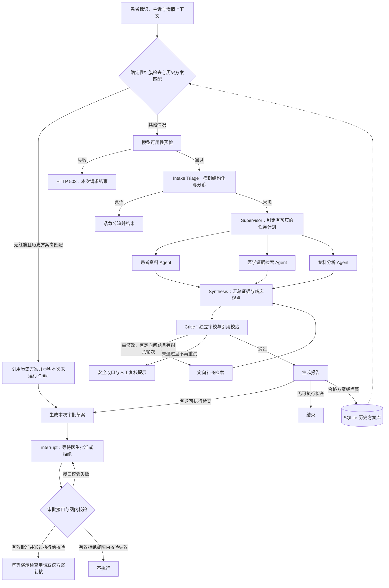
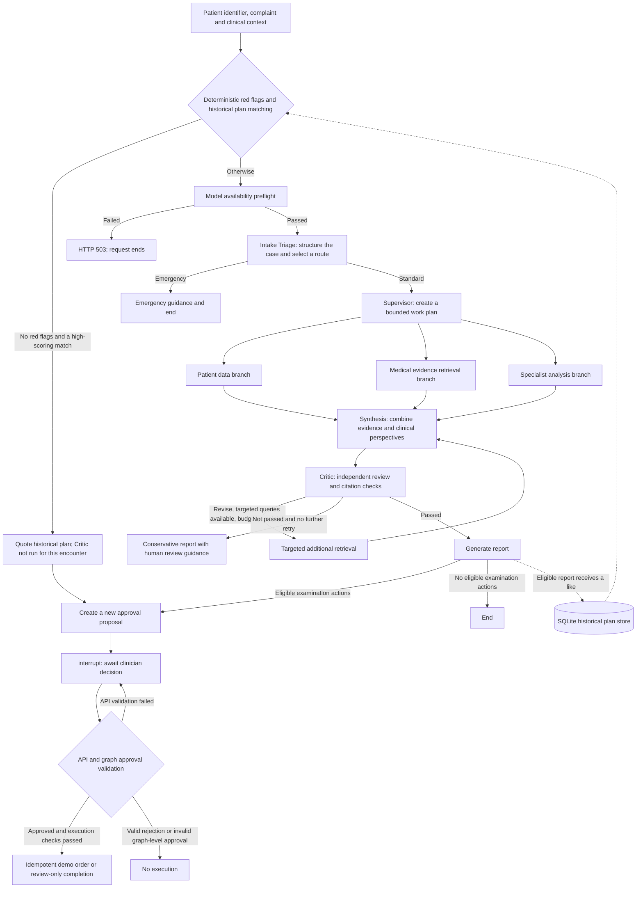

# TripleMed — Medical Multi-Agent

[中文](#中文) | [English](#english)

## 中文

基于 **LangGraph、LangChain 和 FastAPI** 的多智能体临床决策支持原型。项目将病例输入、任务规划、并行证据收集、报告生成、独立审校和医生审批组织为可追踪、具有资源上限的状态图，并通过浏览器展示执行过程。

项目使用模拟患者记录、演示医学资料和演示检查申请工具，用于研究 Agent 编排与人机协作流程，不是经过临床验证的诊疗产品。

### 整体设计

核心思路是将“获取事实”“形成判断”“审校判断”和“执行操作”分开：只读工具负责提供证据，模型输出受结构约束，可能产生操作的检查申请通过独立审批节点执行。



#### 有界多智能体协作

- **Intake Triage**：结合确定性规则和结构化模型输出识别主诉、缺失信息与分诊路径。
- **Supervisor**：依据病例复杂度分配资料读取、检索问题与专科视角，并限制调用预算。
- **三路并行分析**：患者资料、指南证据和专科观点各自更新共享状态，全部完成后进入 Synthesis。并行字段通过 reducer 合并。
- **Synthesis 与 Critic**：先融合证据生成结构化结论，再独立检查证据引用、信息缺口与安全问题。需要补充且预算允许时定向检索，否则输出报告或安全收口。

图结构固定，自适应体现在路由、任务内容、专科视角数量和有限反思轮次；默认最多 2 个专科视角、4 次只读工具请求、首轮 3 个指南检索问题和 1 轮反思；每轮反思额外检索最多 2 个问题，因此默认一次常规流程最多发起 5 个检索问题。患者资料和指南证据分支执行计划中的工具请求，专科分支调用模型；专科观点只基于病例快照与分诊信息，并不读取同轮另外两条分支的新证据。

#### 检索与证据

RAG 结合 BM25 稀疏检索与 Chroma 向量检索，默认融合权重为 0.4 / 0.6，嵌入模型为 `BAAI/bge-base-zh-v1.5`。BM25 当前索引内置演示文本，向量检索读取本地集合；两者的语料范围可能不同。检索器延迟初始化，首次运行可能下载嵌入模型。

工具返回结构化事实、来源标识、时间和演示数据标签。报告保留证据引用，确定性校验与模型审校共同检查引用关系。所有内置医学资料均为专门编写的合成软件测试材料，不摘录真实指南，不提供诊断阈值、药物选择或剂量建议，也不得用于临床决策。

#### 医生审批与工具执行

只读查询与检查申请分开。检查草案绑定病例、患者、版本、内容哈希和有效期；LangGraph `interrupt()` 暂停流程，`/confirm_tool` 校验医生令牌、角色和草案一致性后，通过 `Command(resume=...)` 恢复。执行器使用幂等控制处理重复请求。

执行器与去重记录目前保存在进程内，未连接真实医院系统。接口校验失败不会恢复图，待审批状态保留；恢复后的图节点检查有效期和内容绑定，执行前再次校验。普通报告没有合格检查项目时直接结束，并非所有报告都需要显式审批。

审批通道使用服务端配置的共享令牌，医生 ID 和角色由请求头提供，未接入独立医生身份系统。生产部署需要独立身份认证、持久化状态及审计设施。

#### 本地历史方案复用

符合准入条件的点赞方案存入 SQLite；准入检查报告、风险等级、有效 Critic 通过、结构与引用完整性，不要求已有医生批准。匹配前过滤身份信息，再对主诉文本进行规范化、相似度和已识别症状的否定冲突检查。当前阈值为 0.82，每次最多返回一个方案，允许跨患者匹配；不会逐字段比较两次就诊的完整病情上下文。当前输入中的确定性红旗阻止直接复用。

高匹配方案直接引用历史内容，跳过本次模型分析、RAG 和 Critic，但生成新的病例与审批草案；即使没有检查项目，也需要本次医生复核。历史患者事实和审校结果不能视为当前患者的事实或审批。主诉相似不等于病情一致，规则过滤也不构成通用匿名化保证。点踩仅记录反馈，不撤回已收录方案；对引用方案再次点赞也不生成新的来源方案。

### 技术框架与目录

| 文件 | 职责 |
| --- | --- |
| `main.py` | FastAPI 接口、SSE 事件、会话关联、反馈与审批入口 |
| `graph.py` | LangGraph 节点、条件路由、证据汇总、审校与审批工作流 |
| `agents.py` | 模型角色、提示词、Pydantic 输出结构与解析 |
| `state.py` | 共享状态及并行结果合并规则 |
| `rag_system.py` | 演示资料、BM25 / Chroma 混合检索与来源元数据 |
| `tools.py` | 只读演示工具、审批绑定校验与幂等演示执行器 |
| `answer_knowledge.py` | SQLite 方案存储、身份过滤、匹配与反馈 |
| `config.py` | 模型后端、调用预算、审批和存储配置 |
| `frontend.html` | 对话、执行进度、报告、反馈与审批界面 |
| `tests/` | 安全规则、API、审批流程、方案复用和演示策略测试 |
| `scripts/` | 本地 LM Studio 启动辅助脚本 |

### 本地运行

以下命令适用于 macOS / Linux 的 Bash 或 Zsh，建议使用 Python 3.12。在项目根目录执行：

```bash
python3 -m venv .venv
source .venv/bin/activate
pip install -r requirements.txt
cp .env.example .env
```

编辑 `.env`，设置自己的 `CLINICIAN_APPROVAL_TOKEN` 并选择模型后端：

- **本地模型**：保持 `MODEL_API_KEY` 为空，启动 LM Studio 的 OpenAI-compatible 服务，加载模型，并将 `AGENT_MODEL`、`ROUTER_MODEL`、`VERIFIER_MODEL` 设置为服务实际提供的模型标识。
- **远程模型**：设置 `MODEL_API_KEY`、`MODEL_API_BASE_URL` 和 `API_*_MODEL`。使用此模式时，模型请求中的病例与证据内容会发送到所配置的服务，应仅使用合适的演示输入。

配置文件不会自动加载 `.env`。在同一个终端显式导出环境变量后启动服务：

```bash
set -a
source .env
set +a
python -m uvicorn main:app --host 127.0.0.1 --port 8000
```

可选使用 `bash scripts/start_lm_studio_models.sh` 启动本地模型（先导出 `.env`，并在 LM Studio 中准备相应模型）。脚本按配置原样传递模型 key，不强制量化版本；已加载相同 identifier 的模型会被保留。更换该 identifier 的模型或量化版本时，需要手动卸载后重新加载。

打开 <http://127.0.0.1:8000> 使用界面，<http://127.0.0.1:8000/docs> 查看 API。审批界面输入的令牌须与服务端一致；修改环境变量后需要重启服务。

`CRITIC_DEMO_MODE` 默认开启：仅当证据全部明确标记为演示数据时，将部分来源局限、非必要信息缺口和格式问题作为提示处理。设置为 `false` 可使用标准审校策略。历史方案直接引用路径本身不运行 Critic。

### 测试与实现边界

```bash
python -m unittest discover -s tests -v
```

测试使用模拟输入与替代模型响应，覆盖确定性安全规则、结构化输出、真实 LangGraph 中断/恢复机制、FastAPI 合约、审批绑定、重复执行处理、历史方案复用和演示审校策略。测试通过不代表真实模型端到端验证或临床有效性。

浏览器界面、提示词和内置演示资料主要使用中文；英文文档不代表应用已完成英文适配。

当前使用内存 checkpoint 与会话映射，服务重启会丢失待审批运行状态；SQLite 历史方案单独持久化。未命中历史方案时，模型预检检查服务和模型可见性；失败直接返回 HTTP 503，包括带红旗的请求，因此当前急症报告路径也依赖预检通过。预检不保证后续推理额度或请求成功。依赖采用最低版本约束，尚未提供锁定依赖环境。当前范围是本地研究与演示，当前问诊与反馈接口没有通用用户认证，CORS 允许所有来源，应保持本地运行；真实医疗接入、生产身份权限、持久化工作流和临床评估需要另行实现与验证。


---

## English

TripleMed is a multi-agent clinical decision-support prototype built with **LangGraph, LangChain, and FastAPI**. It organizes case intake, task planning, parallel evidence collection, report generation, independent review, and clinician approval into a traceable state graph with bounded resource use. A browser interface displays workflow progress and results.

The project uses mock patient records, demonstration medical materials, and a simulated examination-order tool. It is intended for exploring agent orchestration and human collaboration and has not been clinically validated.

### Overall design

The design separates fact retrieval, reasoning, review, and action execution. Read-only tools supply evidence, model responses follow structured schemas, and examination orders pass through a dedicated approval gate.



#### Bounded multi-agent collaboration

- **Intake Triage** combines deterministic rules and structured model output to identify the complaint, missing information, and triage route.
- **Supervisor** assigns record queries, retrieval questions, and specialist perspectives according to case complexity and configured budgets.
- **Three parallel branches** collect patient data, retrieve medical evidence, and generate specialist perspectives. Synthesis waits for all three branches. Reducers merge their shared-state updates.
- **Synthesis and Critic** first combine evidence into a structured assessment, then independently review citations, information gaps, and safety issues. A revision with targeted queries and remaining budget triggers additional retrieval; other outcomes produce a report or a conservative fallback.

The graph topology is fixed. Adaptation occurs through routing, task contents, perspective count, and bounded reflection. Defaults allow up to 2 specialist perspectives, 4 read-only tool requests, 3 initial retrieval questions, and 1 reflection round. Each reflection round can add up to 2 retrieval questions, for a default maximum of 5 across a standard workflow.

The patient-data and evidence branches execute tools selected in the plan; the specialist branch calls the model. Specialist perspectives use the case snapshot and triage output, without consuming new evidence from the other two branches in the same parallel stage.

#### Retrieval and evidence

Hybrid RAG combines BM25 sparse retrieval with Chroma vector retrieval, using default weights of 0.4 and 0.6 and the `BAAI/bge-base-zh-v1.5` embedding model. BM25 indexes the bundled demonstration texts, while vector retrieval uses the local collection, so their corpus coverage can differ. Initialization is lazy and may download the embedding model on first use.

Tools return structured facts, source identifiers, timestamps, and demonstration-data labels. Reports retain evidence references, checked by deterministic validation and model review. All bundled medical materials are purpose-written synthetic software fixtures rather than excerpts from real guidelines. They provide no diagnostic thresholds, medication selection, or dosage advice and must not be used for clinical decisions.

#### Clinician approval and execution

Read-only queries are separate from examination-order actions. Each proposal binds the encounter, patient, version, content hash, and expiration time. LangGraph `interrupt()` pauses execution. The `/confirm_tool` endpoint checks the approval token, role, and proposal binding before resuming with `Command(resume=...)`. The executor uses idempotency controls for duplicate requests.

The executor and deduplication records are in memory and do not connect to a real hospital system. Failed API validation leaves the workflow pending; resumed graph nodes validate expiration and content binding, with another check before execution. Standard reports without eligible examination actions end without an explicit approval step.

Approval uses a shared server-side token. Clinician IDs and roles come from request headers, without an independent clinician identity provider. Production use would require institutional authentication, persistent state, and audit infrastructure.

#### Local historical plan reuse

Eligible liked reports are stored in SQLite. Admission checks the report, risk level, successful non-fallback Critic review, structure, and citation integrity; prior clinician approval is not required for admission. Identity filtering precedes complaint normalization, similarity scoring, and checks for conflicting negations of recognized symptoms.

The current threshold is 0.82, with at most one returned plan. Matching can cross patient identities and does not compare the complete clinical contexts field by field. Deterministic red flags in the current input prevent direct reuse.

A matching plan is quoted directly, skipping model analysis, RAG, and Critic for the current encounter. A new encounter and approval proposal are still created. Reuse requires a fresh clinician decision even when there are no examination items. Historical facts and review results are not current patient facts or current approval. Similar complaints do not establish clinical equivalence, and rule-based identity filtering is not a general anonymization guarantee.

A dislike records feedback without withdrawing an admitted plan. Liking a reused plan records feedback on the existing entry rather than creating a new source plan.

### Framework and files

| File | Responsibility |
| --- | --- |
| `main.py` | FastAPI endpoints, SSE events, encounter tracking, feedback, and approval |
| `graph.py` | LangGraph nodes, routing, evidence synthesis, review, and approval workflow |
| `agents.py` | Model roles, prompts, Pydantic response schemas, and parsing |
| `state.py` | Shared state and reducers for parallel outputs |
| `rag_system.py` | Demonstration corpus, BM25 / Chroma hybrid retrieval, and source metadata |
| `tools.py` | Read-only demo tools, approval binding checks, and idempotent demo execution |
| `answer_knowledge.py` | SQLite plan storage, identity filtering, matching, and feedback |
| `config.py` | Model backends, budgets, approval, and storage configuration |
| `frontend.html` | Conversation, progress, reports, feedback, and approval interface |
| `tests/` | Safety rules, API contracts, approval, plan reuse, and demo policies |
| `scripts/` | LM Studio startup helper |

### Run locally

The commands below target Bash or Zsh on macOS / Linux. Python 3.12 is recommended. From the repository root:

```bash
python3 -m venv .venv
source .venv/bin/activate
pip install -r requirements.txt
cp .env.example .env
```

Edit `.env`, set your own `CLINICIAN_APPROVAL_TOKEN`, and select a model backend:

- **Local models:** leave `MODEL_API_KEY` empty, start LM Studio's OpenAI-compatible server, load the models, and set `AGENT_MODEL`, `ROUTER_MODEL`, and `VERIFIER_MODEL` to identifiers exposed by that server.
- **Remote models:** set `MODEL_API_KEY`, `MODEL_API_BASE_URL`, and the `API_*_MODEL` variables. Case and evidence content included in model requests is sent to the configured service; use appropriate demonstration inputs.

The application does not automatically load `.env`. Export it in the same terminal before starting the server:

```bash
set -a
source .env
set +a
python -m uvicorn main:app --host 127.0.0.1 --port 8000
```

Optionally use `bash scripts/start_lm_studio_models.sh` to start local models after exporting `.env` and preparing the relevant models in LM Studio. The script passes model keys unchanged and does not enforce quantization. An already loaded model with the same identifier is retained. To change its model or quantization variant, unload it manually and reload it.

Open <http://127.0.0.1:8000> for the interface or <http://127.0.0.1:8000/docs> for API documentation. The approval token entered in the interface must match the server configuration. Restart the server after changing environment variables.

`CRITIC_DEMO_MODE` defaults to enabled. Only when all evidence is explicitly labeled as demonstration data can certain source limitations, optional information gaps, and presentation issues be treated as advisories. Set it to `false` for the standard review policy. The direct historical-plan path does not run Critic regardless of this setting.

### Tests and implementation boundaries

```bash
python -m unittest discover -s tests -v
```

Tests use synthetic inputs and substituted model responses. They cover deterministic safety rules, structured output, actual LangGraph interrupt/resume mechanics, FastAPI contracts, approval binding, duplicate execution handling, historical plan reuse, and demo review policies. Passing these tests does not establish real-model end-to-end behavior or clinical effectiveness.

The interface, prompts, and bundled demonstration materials are primarily in Chinese. This English documentation does not imply that the application has been localized into English.

Checkpoints and encounter mappings are in memory, so restarting the service loses pending workflow state. Historical plans are persisted separately in SQLite. When no historical plan matches, the preflight checks backend and model visibility and returns HTTP 503 on failure, including for inputs with red flags. The emergency-report path therefore also depends on a successful preflight. Model visibility does not guarantee inference quota or successful requests.

Dependencies use minimum-version constraints without a lockfile. The consultation and feedback endpoints lack general user authentication, and CORS allows all origins. Keep the prototype local. Real clinical integrations, production identity and access controls, persistent workflows, and clinical evaluation require separate implementation and validation.
